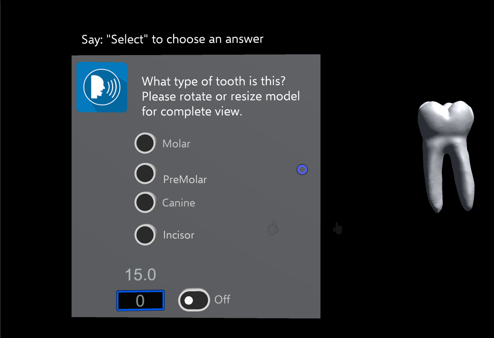
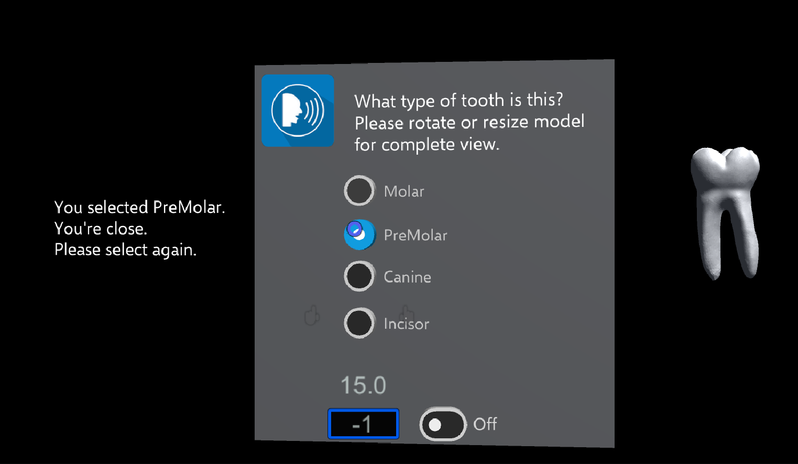
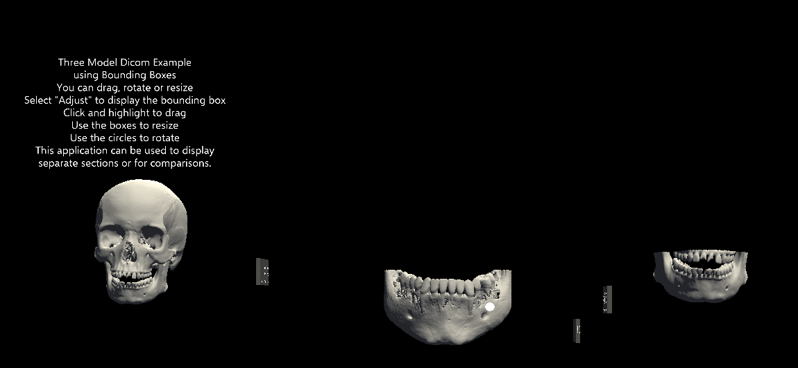
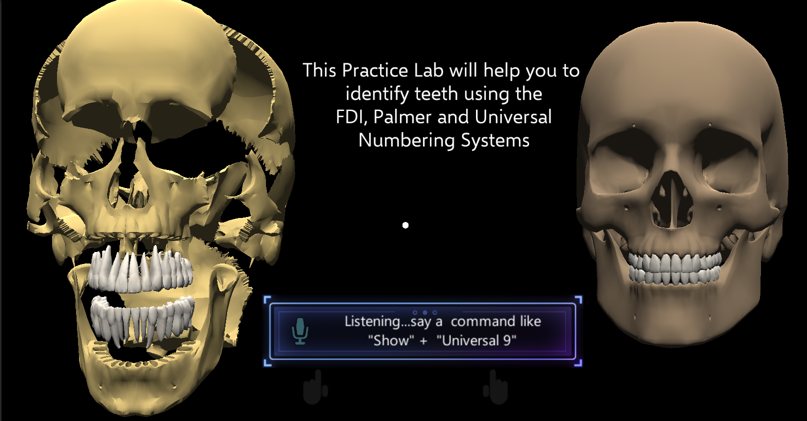

# Meharry HoloLens Prototype

## Background/Purpose:  

Over the past decade there has been a continuous debate over the needed change for dental education.  The question in dentistry is no longer, “Should we acquire new technologies,” but which ones are most beneficial to patient care. The face of dentistry has changed outside the classroom, which calls for an equally impressive change within. One such change is the utilization of Augmented Reality (AR) to create an immersive learning environment through the utilization of the Microsoft's HoloLens.

This repository contains video links and screen shots to early prototype testing.  The videos demonstrate holographic sharing, speech and grammer recognition and manipulation. Assets were developed by converting DICOM data for display in the HoloLens. 

## Screenshots

<table>
    <tr>
        <td>
            
        </td>
        <td>
            
        </td>
        <td>
            
        </td>
		<td>
            
        </td>
    </tr>
</table>

## Video Demonstrations: 

[Teeth Classification : Speech/Grammar Recognition](https://drive.google.com/open?id=0B01rMfZ-W8x0SlA0T0F1MjcySUU)

[Voice Commands with DICOM Models ](https://drive.google.com/open?id=0B01rMfZ-W8x0S19zUmQwQXJwdzg)

[DICOM Models in Bounding Boxes ](https://drive.google.com/open?id=0B01rMfZ-W8x0S19zUmQwQXJwdzg)

[Holographic Sharing Demo1 ](https://drive.google.com/open?id=0B01rMfZ-W8x0Y29UbE1oazBCX00)

[Holographic Sharing Demo2 ](https://drive.google.com/open?id=0B01rMfZ-W8x0dmR3TlBtZW5CRzA)

[Early bounding box demo ](https://drive.google.com/open?id=0B01rMfZ-W8x0d3JoTkpJUW9RZ1E)

